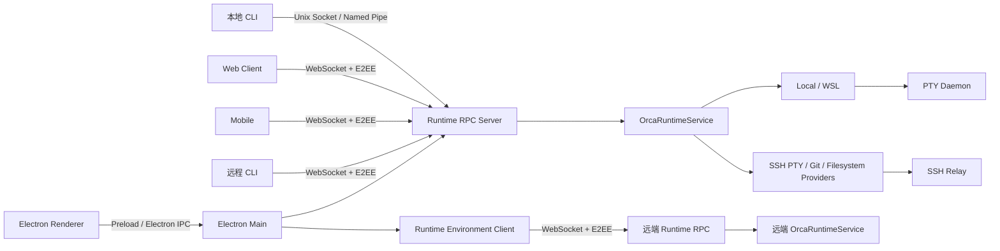

# Orca 二次开发架构基线

> 状态：已完成源码核验，可作为二次开发设计输入
>
> 基线提交：`6e1aa8503c688f85d16b4c72981e2f5e862e491f`
>
> 基线版本：`1.4.139-rc.1`
>
> 更新日期：2026-07-14
>
> 许可证：MIT

## 1. 文档目标

本文档用于回答四个问题：

1. Orca 当前是什么产品，包含哪些主要能力和运行组件。
2. 各模块之间如何通信、如何确定资源所有权、如何持久化状态。
3. 新功能应落在哪些模块，哪些边界不能绕过。
4. 二次开发需要满足哪些跨平台、SSH、安全、兼容和验证要求。

本文档是架构基线，不是具体业务需求设计。后续每个二开需求仍需单独确认目标架构、数据模型、权限面和兼容范围。

### 快速导航

| 阅读目标 | 章节 |
| --- | --- |
| 了解产品、技术栈和领域模型 | 2 至 7 |
| 了解桌面启动、Renderer 和 IPC | 8 至 10 |
| 了解 Runtime RPC、远端 Runtime 和 SSH | 11 至 13 |
| 了解 Terminal、Git 和持久化 | 14 至 16 |
| 了解 Web、Mobile、CLI 和 Headless | 17 至 19 |
| 了解 Agent、扩展机制、安全和发布 | 20 至 22 |
| 确定二开落点、风险和 Fork 策略 | 23 至 28 |
| 执行验证和开发前检查 | 29 至 34 |

## 2. 执行摘要

Orca 不是一个单纯的 Electron 前端，而是一个围绕 Git worktree 和终端代理构建的多运行时系统。

它由以下六个运行域组成：

1. Electron 主进程
2. Electron Preload
3. React 渲染端
4. 本地及远程 CLI
5. SSH Relay
6. Mobile 与 Web 配对客户端

系统存在两条容易混淆的远程执行路径：

- **SSH Relay**：当前桌面主进程主动连接 SSH 主机，在远端部署轻量 Relay，并在本地主进程注册远程 PTY、Git、Filesystem Provider。
- **Runtime Environment**：目标主机运行完整的 `orca serve`，客户端通过配对码和 WebSocket E2EE 调用目标主机的 Runtime RPC。

二次开发最重要的架构原则是：

> 所有涉及仓库、工作区、文件、Git、终端和浏览器的行为，都必须按资源的明确所有者路由，不能根据当前聚焦主机或当前页面状态推测执行位置。

资源所有者由 [`ExecutionHostId`](../../src/shared/execution-host.ts) 表达：

- `local`
- `ssh:<targetId>`
- `runtime:<environmentId>`

## 3. 产品能力全景

Orca 的核心产品定位是并行代理开发工作台，主要能力包括：

- 管理项目、仓库、Git worktree 和普通文件夹工作区。
- 在不同 worktree 中并行运行 Codex、Claude Code、OpenCode、Pi 等 CLI Agent。
- 多标签、多分组、终端 Pane 递归分屏。
- Monaco 文件编辑、Diff、冲突处理、Markdown/PDF/图片预览。
- 内置 Chromium 浏览器、Design Mode、截图和页面操作。
- Git 状态、提交、拉取、推送、分支比较和历史浏览。
- GitHub、GitLab、Bitbucket、Azure DevOps、Gitea 等 Provider 集成。
- Linear、Jira 等任务来源集成。
- SSH 工作区、远程文件、远程 Git、远程终端和端口转发。
- Mobile Companion 和 Web 客户端远程控制。
- 自动化任务、编排任务、终端驱动的多 Agent 协作。
- CLI 控制、`orca serve` 无头运行和 Computer Use。
- Agent Hooks、状态检测、账号切换、用量和限流状态。
- 多 Profile、本地化、遥测、崩溃恢复和自动更新。

## 4. 技术栈

### 4.1 桌面端

| 层级 | 技术 |
| --- | --- |
| 桌面容器 | Electron 43 |
| 渲染框架 | React 19 |
| 状态管理 | Zustand 5 |
| 语言 | TypeScript 7 |
| 构建 | Vite 7、electron-vite |
| 样式 | Tailwind CSS 4 |
| UI Primitive | shadcn 风格封装、Radix UI |
| 终端 | xterm.js 6 beta、WebGL |
| 编辑器 | Monaco Editor |
| Schema | Zod 4 |
| 测试 | Vitest、Playwright |
| 打包 | electron-builder |
| 运行时 | Node.js 24 |

### 4.2 Mobile

| 层级 | 技术 |
| --- | --- |
| 框架 | Expo 55 |
| UI | React Native 0.83 |
| 路由 | Expo Router |
| 状态 | Zustand |
| 通信 | WebSocket、tweetnacl E2EE |
| 凭据 | expo-secure-store、AsyncStorage |
| 终端 | WebView 中的 xterm.js |
| 原生扩展 | Swift、Kotlin Expo Module |

### 4.3 原生与远程组件

- 本地 PTY：`node-pty`。
- 文件监听：`@parcel/watcher`。
- SSH：`ssh2`、SFTP、远程 Relay。
- 本地终端 Daemon：独立 Node 进程和 socket/RPC。
- macOS Computer Use：Swift 6，最低 macOS 14。
- Linux Computer Use：Python、DBus、AT-SPI、GI。
- Windows Computer Use：PowerShell UIAutomation/Win32。
- Windows CLI Launcher：C#，用于保持多行参数和命令行语义。

## 5. 仓库目录地图

| 路径 | 职责 |
| --- | --- |
| `src/main/` | Electron 主进程、业务服务、IPC、Runtime、PTY、Git、SSH、Provider、更新和持久化 |
| `src/preload/` | 受审计的 Renderer 与 Electron 权限桥 |
| `src/renderer/src/` | React UI、Zustand Store、终端、编辑器、浏览器、Web Adapter |
| `src/shared/` | 跨运行域类型、协议、Schema、纯函数和兼容逻辑 |
| `src/cli/` | CLI 参数、命令处理、Runtime Client 和输出 |
| `src/relay/` | 部署到 SSH 主机的轻量远程 Daemon |
| `mobile/` | 独立 Expo/React Native 工程 |
| `native/` | macOS、Linux、Windows 原生辅助组件 |
| `config/` | TypeScript、Vite、Vitest、打包、发布和校验脚本 |
| `tests/e2e/` | Electron Playwright 端到端测试 |
| `tools/` | 基准测试、诊断和专项工具 |
| `resources/` | 图标、CLI Launcher、安装包资源和 Onboarding 资产 |
| `build-plugins/` | 构建期插件和依赖边界守卫 |
| `skills/` | 源码仓库内的使用指南，不会作为桌面 Runtime 插件打包 |
| `docs/` | 产品文档、架构参考和设计约束 |

当前基线约包含：

- `src/` 下 6,900 多个文件。
- `mobile/` 下 700 多个文件。
- 3,000 多个单元或组件测试文件。
- 125 个 Electron E2E 场景。
- 355 个被 max-lines 棘轮托管的历史超长文件或 Mobile 配置例外。

这些数字是当前提交快照，不应作为稳定 API。

## 6. 总体运行架构



### 6.1 控制面

Electron 主进程是桌面应用的组合根，负责：

- 应用生命周期。
- Profile 和持久化。
- BrowserWindow 与安全策略。
- Electron IPC。
- 本地 Runtime RPC Server。
- Runtime Environment Client。
- PTY Daemon。
- SSH 连接和 Relay。
- 自动化、Agent Hooks、账号、更新器、遥测和原生能力。

### 6.2 数据面

实际执行行为按领域拆分：

- PTY Provider：终端创建、输入、尺寸、快照、重连和退出。
- Git Provider：Git 查询和变更。
- Filesystem Provider：文件读取、写入、搜索和监听。
- Browser Backend：桌面 WebView 或无头 Offscreen WebContents。
- Runtime RPC：跨 CLI、Web、Mobile、远端 Runtime 的统一业务入口。

## 7. 核心领域模型

### 7.1 项目与主机

核心关系为：

```text
Project
  -> ProjectHostSetup
    -> Repo
      -> Worktree 或 FolderWorkspace
        -> TabGroup
          -> Tab
            -> Terminal Pane / Editor / Diff / Browser / Simulator
```

主要类型位于 [`src/shared/types.ts`](../../src/shared/types.ts)。

#### Project

Project 是跨主机的稳定项目身份，包含显示信息、Provider 身份、远程身份和源 Repo 列表。

#### ProjectHostSetup

ProjectHostSetup 表示某 Project 在某个 Execution Host 上的安装或检出状态，包含：

- `projectId`
- `hostId`
- `repoId`
- 路径
- Setup 状态
- Setup 方法
- Git 用户信息
- Worktree 基础路径

同一个 Project 可以在多个主机上拥有不同 Setup。

#### Repo

Repo 是执行和 Git 操作的主要载体。关键字段包括：

- `path`
- `connectionId`
- `executionHostId`
- `worktreeBaseRef`
- `worktreeBasePath`
- Provider 远程身份
- Worktree 可见性和 Hook 配置

历史数据可能缺少显式 `executionHostId`，此时才允许通过 `connectionId` 兼容推导。

### 7.2 Workspace

Workspace 有两种：

- Git Worktree。
- 普通 Folder Workspace。

统一 UI 身份使用：

- `worktree:<worktreeId>`
- `folder:<folderWorkspaceId>`

不能假设所有工作区都是 Git 仓库。

### 7.3 Tab 与 Pane

统一 Tab 支持：

- Terminal
- Editor
- Diff
- Conflict Review
- Check Details
- Browser
- Simulator

Tab Group 使用递归 Split Tree。Terminal 内部还有第二层 Pane Split Tree。

终端和浏览器属于有状态宿主，切换 Tab 时通常保持挂载，通过 Overlay、Anchor 和 Parking 控制可见性，不能简单条件卸载。

## 8. Electron 启动与生命周期

主入口为 [`src/main/index.ts`](../../src/main/index.ts)。

启动顺序的关键约束如下：

1. 在 Electron ready 前处理 packaged CLI、AppImage、`--serve` 和 GPU 参数。
2. 在 `app.setName()` 前固定 canonical userData 路径，避免大小写敏感文件系统出现两个数据目录。
3. 配置单实例锁、开发实例身份、PATH、代理和网络兼容。
4. Electron ready 后选择活动 Profile，并同步加载 Store。
5. 初始化账号、限流、浏览器 Session、遥测、可观测性和 Agent 状态服务。
6. 构造 `OrcaRuntimeService`。
7. 构造 Automation、Browser、Emulator、Hooks 等服务。
8. 构造并启动 Runtime RPC Server。
9. 桌面模式并行打开窗口与绑定 Runtime RPC。
10. `--serve` 模式不创建 Renderer，而是注册 Headless PTY、可选 Offscreen Browser 和 Headless Automation。

本地 PTY Provider 必须延迟解析。应用先拥有进程内 Provider，首窗口后台服务随后启动 PTY Daemon，并将本地 Provider 替换为 Daemon Routed Adapter。

退出顺序同样是架构合同：

1. 停止自动化、Agent Hooks 和状态服务。
2. Flush Store 和统计。
3. 关闭 Watcher。
4. 请求 Daemon 写入最终 Checkpoint。
5. 停止 Runtime RPC Transport。
6. 按 Runtime 所有权清理 Metadata。
7. Flush 遥测和可观测性。
8. 再允许 Electron 退出。

普通退出只断开 Daemon，以便应用重启后重新附着；开发父进程死亡等场景才彻底关闭 Daemon。

## 9. Renderer 架构

### 9.1 启动

[`src/renderer/src/main.tsx`](../../src/renderer/src/main.tsx) 完成：

- 全局 CSS。
- Crash Diagnostics。
- 主题初始化。
- I18n Provider。
- 根级错误边界。
- React StrictMode。
- `App` 挂载。

### 9.2 页面导航

项目没有 React Router。顶层页面由 Zustand 中的 `activeView` 状态控制。

页面包括：

- Terminal
- Settings
- Tasks
- Activity
- Automations
- Space
- Skills
- Mobile

[`App.tsx`](../../src/renderer/src/App.tsx) 负责 Lazy Load、全局 Provider、快捷键、生命周期 Hook 和页面分派。

新增顶层页面必须同时处理：

- `TopLevelView` 类型。
- UI Slice。
- 返回视图语义。
- 持久化和迁移。
- App Lazy Load。
- 快捷键和菜单入口。
- Web 客户端可用性。

### 9.3 Zustand Store

[`store/index.ts`](../../src/renderer/src/store/index.ts) 将约 37 个领域 Slice 平铺合并为一个 Store。

主要 Slice 包括：

- repos
- worktrees
- terminals
- tabs
- ui
- settings
- keybindings
- github
- hosted-review
- linear
- jira
- editor
- browser
- ssh
- runtime-environment-ssh
- agent-status
- workspace-space
- workspace-cleanup
- usage 和 rate-limits

代码按领域拆分，但运行时仍是单一大 Store，跨 Slice `get()` 调用较多。新增功能应避免在无明确所有权的情况下写入多个 Slice。

### 9.4 UI 设计系统

所有 UI 修改必须遵循 [`docs/STYLEGUIDE.md`](../STYLEGUIDE.md)。

规则包括：

- 色彩、字号、间距和阴影优先使用 [`main.css`](../../src/renderer/src/assets/main.css) Token。
- 优先复用 `components/ui/` 下的 shadcn/Radix Primitive。
- 图标统一使用 `lucide-react`。
- Orca 的视觉语言是安静、单色、工作导向。
- UI 必须兼容浅色、深色、macOS、Windows、Linux 和 SSH 延迟。
- 快捷键实现与显示必须同时按平台切换。
- 不得在页面业务组件中随意硬编码新色值、字号或阴影层级。

## 10. Preload 与 Electron IPC

### 10.1 Preload

[`src/preload/index.ts`](../../src/preload/index.ts) 通过 `contextBridge` 暴露 `window.api`。

它是完整桌面权限表面，覆盖：

- Repo、Project、Worktree。
- Git 和文件系统。
- PTY 和 Terminal。
- Browser。
- SSH。
- Runtime Environment。
- Settings、UI、Session。
- Agent、账号、通知、更新器和原生能力。

`PreloadApi` 定义在 [`src/preload/api-types.ts`](../../src/preload/api-types.ts)。

新增 Electron IPC 时必须同步：

1. Shared 类型或 Schema。
2. Main IPC Handler。
3. Preload Binding。
4. `PreloadApi` 类型。
5. Renderer 调用方。
6. Sender 归属和资源清理测试。

当前没有统一生成式 IPC 合同，因此 Channel 名称、参数和返回值存在手工漂移风险。

### 10.2 BrowserWindow 安全

主窗口使用 Preload 和 Renderer Sandbox。

内置浏览器 WebView 的安全策略包括：

- Partition 必须由 Browser Session Registry 认可。
- 移除 WebView Preload。
- 禁止 Node Integration。
- 开启 Context Isolation、Sandbox 和 Web Security。
- 拒绝任意 Popup。
- 阻止主窗口导航到远程页面。
- 外部链接通过系统浏览器打开。

部分特权 IPC 会记录可信顶层 `webContentsId`。Runtime Environment 的 Streaming Subscription 还会绑定 Owner `webContentsId`，并在 Renderer 销毁时清理。

需要注意：并非所有普通 `ipcMain.handle` 都通过统一中间件验证 Sender。当前安全模型高度依赖顶层 Renderer 不被远程页面替换或注入。

## 11. Runtime RPC

### 11.1 定位

Runtime RPC 是 Orca 跨桌面、CLI、Web、Mobile 和无头服务的主要扩展脊柱。

方法总表位于：

[`src/main/runtime/rpc/methods/index.ts`](../../src/main/runtime/rpc/methods/index.ts)

主要领域包括：

- status
- repo
- worktree
- terminal
- files
- git
- browser
- orchestration
- automations
- notifications
- accounts
- native chat
- provider integrations
- SSH
- speech
- clipboard
- skills
- workspace ports

每个方法将名称、Zod 参数 Schema 和 Handler 绑定在同一对象中。Dispatcher 负责：

- 方法查找。
- 参数校验。
- 同步或流式分派。
- 错误归一化。
- Runtime ID 元数据。

### 11.2 本地 CLI Transport

本地 CLI 使用：

- Unix Domain Socket，或
- Windows Named Pipe。

CLI 从权限加固的 Runtime Metadata 文件读取 Endpoint 和共享 `authToken`。

Metadata 是 CLI 发现 Runtime 的唯一入口。Runtime 无法写入 Metadata 时会关闭已经启动的 Transport，避免出现“运行中但不可发现”的控制面。

### 11.3 WebSocket 与 E2EE

Web、Mobile 和远程 CLI 使用：

- 监听 `0.0.0.0` 的 WebSocket。
- 每设备独立 Token。
- Curve25519 密钥交换。
- tweetnacl 应用层 E2EE。
- 加密后的 JSON 与 Binary Frame。

协议没有依赖自签名 TLS 证书钉扎，身份绑定来自配对载荷中的服务端公钥。

配对载荷 v2 包含：

- Endpoint
- Device Token
- Server Public Key
- Scope

Scope 分为：

- `mobile`：只能访问显式白名单。
- `runtime`：默认可以访问完整 Runtime RPC Surface。

因此新增 RPC 方法时，不能只考虑“是否注册”，还必须明确：

- Runtime Scope 是否应该拥有该能力。
- Mobile Scope 是否加入白名单。
- 是否包含凭据或高权限文件操作。
- 是否需要 Streaming 或 Binary Transport。
- 断线后如何清理。
- 是否需要 Capability 协商。

### 11.4 协议兼容

协议当前为：

- Runtime Protocol：3。
- 最低兼容 Client：2。
- 最低兼容 Server：2。

兼容依据是协议窗口，不要求 App Version 完全一致。

以下变更通常需要提高协议版本：

- 删除客户端使用的方法或必填参数。
- 改变已有字段的含义、单位或可空性。
- 改变加密、认证或终端帧协议。

以下变更通常不需要提高协议版本：

- 新增方法。
- 新增可选字段。
- 新增旧客户端可忽略的事件。

Mobile 因 Metro 边界手工镜像协议常量，必须通过跨工程契约测试防止漂移。

## 12. Runtime Environment

Runtime Environment 表示另一个运行完整 `orca serve` 的主机。

Renderer 通过 `window.api.runtimeEnvironments` 请求主进程连接远端 Runtime。

主进程 Transport Routing 会按方法选择：

- One-shot WebSocket。
- Cached Request Connection。
- Shared Control Connection。
- Dedicated Streaming Connection。

例如：

- `terminal.send` 和 `terminal.updateViewport` 使用缓存请求连接。
- `files.watch` 等可以使用 Shared Control。
- `terminal.multiplex` 和 `browser.screencast` 保持独占连接。

远端调用前会执行协议兼容和 Capability 探测。探测结果具有 TTL、失败缓存、并发合并和 Host 隔离。

二开不能绕过 Renderer Runtime Adapter 直接调用本地 IPC，否则同一功能在远端 Runtime、Web 客户端和 `orca serve` 上会失效。

### 12.1 代表调用链：创建 Worktree

Renderer 创建 Worktree 的完整链路如下：

1. New Workspace Composer 构造创建请求。
2. `worktree-creation-flow.ts` 先创建 Pending UI，并切换到目标 Workspace。
3. Worktree Slice 根据 Repo Owner 解析执行 Host。
4. Local Owner 调用 `window.api.worktrees.create`。
5. Runtime Owner 调用 `callRuntimeRpc('worktree.create')`。
6. Local IPC 进入 Main Process Worktree Handler。
7. Remote 调用经过 Runtime Environment IPC 和 Transport Routing。
8. 目标 Runtime 完成 E2EE、Token、Scope、方法和 Zod 校验。
9. `OrcaRuntimeService.createManagedWorktree` 根据 Repo 再选择 Local/WSL 或 SSH Git Provider。
10. Git 层执行 Worktree Add、兼容 Fallback、Metadata 和 Setup Hook。
11. Renderer 用真实 Worktree 替换 Pending 项，并处理 Watcher 与主动响应的竞态去重。

该链路说明：Worktree 创建不是一个可以只在 Renderer 或单个 IPC Handler 中实现的动作。

## 13. SSH Relay

### 13.1 角色

SSH Relay 是部署到远程 SSH 主机的轻量 Node Daemon，不是完整 Orca Runtime。

它提供：

- PTY。
- 文件系统。
- Git。
- 文件监听。
- 端口扫描。
- Agent Hooks。
- 外部 Automation Adapter。
- 远程 CLI Bridge。

### 13.2 连接模型

桌面主进程建立 SSH 连接后：

1. 检测远端平台和架构。
2. 部署对应 Relay Bundle。
3. 启动 Relay。
4. 完成版本握手。
5. 建立 Multiplexer。
6. 做响应探针。
7. 安装 Agent Hooks、Overlay 和远程 CLI。
8. 注册 SSH PTY、Filesystem、Git Provider。
9. 重附着已知 PTY。
10. 进入 Ready。

Relay 使用带 13 字节 Header 的帧协议和 JSON-RPC 2.0，包含：

- Sequence。
- ACK。
- Keepalive。
- 16 MB 单帧限制。
- Bulk Streaming。
- Request Cancel。
- Backpressure。

### 13.3 断线与重连

SSH 通道断开后，Relay 在 Grace Period 内继续持有 PTY，并监听本地 Socket。

新 SSH 通道通过 `relay --connect` 连接旧 Socket，因此恢复的是同一个远端 Relay 和同一批 PTY，不是重新创建终端。

SSH Session 是单目标状态机，负责 Provider 注册、回收、重连和 Relay Lost Backoff。

### 13.4 安全边界

Relay 运行在 SSH 用户权限下。当前设计不再保留通用文件根 Allowlist，因为已经暴露的 PTY 和 Git 执行能力足以访问该 SSH 用户可访问的路径。

这意味着：

> Renderer 或 Runtime Scope 凭据一旦被完全攻破，SSH Relay 不能提供第二层文件沙箱。

二开应把安全重点放在 Renderer 导航隔离、IPC Sender、RPC Scope、Token、参数校验和操作确认上。

### 13.5 代表调用链：SSH 终端

SSH Workspace 创建终端的链路如下：

1. Renderer 或远程 Client 请求 `terminal.create`。
2. Runtime RPC Dispatcher 校验参数。
3. `OrcaRuntimeService.createTerminal` 解析 Workspace 和 Repo Owner。
4. PTY Controller 根据 `connectionId` 路由到 `SshPtyProvider`。
5. `SshPtyProvider` 通过 Multiplexer 发出 `pty.spawn` 或 `pty.attach`。
6. Relay Dispatcher 进入 `PtyHandler`。
7. 远端 `node-pty` 创建或附着真实进程。
8. Relay 发送 `pty.data`、`pty.replay` 和 `pty.exit`。
9. Desktop Provider 将 Relay PTY ID 转为全局 App PTY ID。
10. Main Runtime 更新模型和 Side Effect，再按可见性和 ACK 策略投递 Renderer。
11. SSH 断线时 Relay 继续持有进程；重连后通过 `pty.attach` 恢复。

身份校验必须同时考虑 Session、Pane、Tab 和 Connection，不能只使用 Relay 内部 PTY ID。

## 14. Terminal 与 PTY

### 14.1 Provider

统一 [`IPtyProvider`](../../src/main/providers/types.ts) 支持：

- Spawn 和 Attach。
- 输入、Resize、Signal 和 Shutdown。
- Replay、Snapshot 和 Cold Restore。
- Foreground Process。
- Child Process 检测。
- Producer Backpressure。
- Hidden Delivery。
- Buffer Snapshot。
- Data ACK。
- PTY 列表和事件订阅。

实现包括：

- LocalPtyProvider。
- Daemon PTY Provider。
- Degraded Local Fallback。
- SSH PTY Provider。

WSL 通过本地 Provider 的 Shell 和 Distro 参数进入 `wsl.exe`，不是 SSH Relay。

### 14.2 Daemon

本地 PTY Daemon 独立于 Electron Renderer 和主窗口生命周期。

它负责：

- 持有本地 PTY。
- 维护 Headless Emulator。
- 保存 Checkpoint。
- 应用重启后重新附着。
- 终端输出流和 Backpressure。

因此不能把 Renderer Store 中的 `ptyId` 当作进程本身，也不能把组件 Unmount 当作 PTY Shutdown。

### 14.3 Model 与 View

终端遵守 [`terminal-model-view-contract.md`](./terminal-model-view-contract.md)。

核心不变量包括：

- 终端模型所有权与可见 View 分离。
- 隐藏 View 不应阻塞主模型前进。
- Side Effect 只由一个 Authority 解析。
- Replay 不应重复触发通知和注意力事件。
- Query Reply 只有一个写入者。
- ACK 和 Backpressure 必须有界。
- Remote Runtime 终端的数据权威与本地/SSH 不同。

修改 Terminal、PTY、Agent Status、通知、标题、Bell、OSC、恢复或 Parking 时，必须先阅读：

- [`terminal-model-view-contract.md`](./terminal-model-view-contract.md)
- [`terminal-query-authority.md`](./terminal-query-authority.md)
- [`terminal-side-effect-authority.md`](./terminal-side-effect-authority.md)
- [`terminal-hidden-view-parking.md`](./terminal-hidden-view-parking.md)

## 15. Git 与 Source Control

### 15.1 执行路径

Git 操作可能运行于：

- 本机。
- WSL Distro。
- SSH Relay。
- 远端 Runtime 主机。
- 远端 Runtime 再连接的 SSH Host。

Git 与 Filesystem 使用独立 Provider，不通过 PTY 模拟命令交互。

### 15.2 Git 版本兼容

核心工作流基线为 Git 2.25。

采用新 Git 能力时必须：

1. 保留 Git 2.25 可执行的 Fallback。
2. 使用窄错误谓词判断“不支持”，不能吞掉真实错误。
3. 通过 `GitCapabilityCache` 缓存 Capability。
4. 按实际执行 Host 隔离缓存。
5. 覆盖首次 Fallback、后续缓存、并发 Probe 和 Host 隔离。
6. 更新真实 Git 二进制 CI 矩阵。

不能只解析 `git --version`，也不能假设 `simple-git` 会解决版本差异。

### 15.3 Provider 中立

通用评审和 Source Control 逻辑不能使用 GitHub 专属命名或行为。

项目支持：

- GitHub
- GitLab
- Bitbucket
- Azure DevOps
- Gitea

Provider 特有逻辑必须放在显式分支或 Adapter 中。

## 16. 持久化

### 16.1 主状态

每个 Orca Profile 拥有自己的 `orca-data.json`。

其中包含：

- Projects、ProjectHostSetups、Repos。
- Project Groups、Folder Workspaces。
- Worktree Metadata 和 Lineage。
- Settings、UI。
- Workspace Session。
- 每 Host Workspace Session 分区。
- SSH Target 和 PTY Lease。
- Agent Session 恢复信息。
- Automations 和运行记录。
- Onboarding 等业务状态。

本地 Host 保留在 Legacy `workspaceSession` 字段，非本地 Host 使用 `workspaceSessionsByHostId`，以保持降级兼容。

### 16.2 写入模型

Store 写入具有：

- 1 秒尾随 Debounce。
- 5 秒最大等待。
- 内容 Hash 去重。
- 异步串行写。
- 临时文件加进程和随机后缀。
- 原子 Rename。
- 同步退出 Flush。
- Write Generation，避免异步旧写覆盖同步新写。
- 5 份滚动备份。
- 至少 1 小时备份间隔。
- 主文件损坏时逐份恢复。

新增持久字段不能只改 Type，必须同时处理：

1. 默认值。
2. Load Normalize。
3. Schema 校验。
4. 旧版本迁移。
5. Host 分区。
6. 写入触发。
7. 降级兼容。
8. 损坏和部分字段缺失。

### 16.3 其他持久化文件

| 文件 | 用途 |
| --- | --- |
| `orca-profile-index.json` 及 `profiles/<profileId>/` | Profile 索引和每 Profile 主状态 |
| `orca-github-cache.json` | 可重建的 GitHub 缓存 Sidecar |
| `orchestration.db` | 编排消息、任务、Gate 和 Dispatch，SQLite WAL |
| `orca-environments.json` | 已配对 Runtime Environment |
| `orca-runtime.json` | CLI Bootstrap Metadata |
| `orca-devices.json` | WebSocket 配对设备和 Scope |
| `orca-e2ee-keypair.json` | Runtime E2EE 密钥对 |
| `mobile-ws-fallback-port.json` | 稳定的 WebSocket Fallback 端口 |
| Terminal Scrollback Snapshot | 大体积终端滚动内容 |

密钥和配对文件使用权限加固写入。部分应用 Secret 使用 Electron `safeStorage`；当系统不可用时，不能假设主状态文件整体加密。

`orchestration.db` 当前通过 Electron `app.getPath('userData')` 延迟创建，是安装实例级数据库，不随活动 Profile 的 `orca-data.json` 一起切换。涉及多 Profile 编排隔离的二开必须先确认这是期望行为还是需要新增迁移。

### 16.4 路径风险

项目同时存在：

- 启动早期固定的 Canonical userData。
- Electron 当前 `app.getPath('userData')`。
- 每 Profile 独立目录。

修改应用名称、Profile、开发实例、配对、Runtime Environment 或迁移逻辑时，必须确认每个文件应属于哪一级路径。

## 17. Web 客户端

Web 客户端复用桌面 `App`，但没有 Electron Preload。

[`web-preload-api.ts`](../../src/renderer/src/web/web-preload-api.ts) 在浏览器内构造兼容的 `window.api`，其中：

- 本地 UI 状态使用 LocalStorage。
- Host 业务调用转为 Runtime RPC。
- 不支持的桌面能力提供安全 Fallback。
- Workspace Session 在 Web 侧做 Sanitization。

Web 配对使用 `runtime` Scope，权限高于 Mobile。

配对凭据通过 URL Fragment 传入，避免进入代理日志和 Referer；导入后立即清理地址栏。

新增桌面功能时必须决定：

- Web 是否支持。
- Web Adapter 是真实实现、远程转发还是明确不可用。
- 不支持时 UI 是否隐藏。
- 是否依赖 Electron 独有能力。

## 18. Mobile

Mobile 是独立 Expo 工程，不会被打包进桌面安装包。

Mobile 通过 Mobile Scope Runtime RPC：

- 查看工作区和 Agent 状态。
- 订阅和操作终端。
- 浏览文件、Diff 和 Source Control。
- 使用 Browser Screencast。
- 查看账号与用量。
- 接收通知。

Mobile 不直接连接 SSH 主机。SSH 工作区链路为：

```text
Mobile
  -> Desktop Runtime RPC
    -> OrcaRuntimeService
      -> SSH Provider
        -> Relay
```

Mobile 二开注意：

- Protocol 常量和 Desktop 存在手工镜像。
- Mobile RPC Allowlist 必须同步审计。
- Native Token 存入 Secure Store，Web Fallback 才使用 AsyncStorage。
- Terminal 使用 WebView，不能假设与桌面 xterm 生命周期一致。
- 音频能力依赖私有 Expo Native Module。
- 当前 Mobile PR CI 主要覆盖 TypeScript、Vitest、Lint 和 Format，不等于真实设备验证。

### 18.1 代表调用链：Mobile 发送终端输入

1. Mobile Session 页面调用 `terminal.send`。
2. Mobile RPC Client 等待 E2EE Channel Ready。
3. 请求以 Device Token 身份在加密通道内发送。
4. Desktop Runtime 将认证身份绑定到当前 WebSocket。
5. Runtime RPC 检查 Mobile Allowlist。
6. Terminal Method 校验 Handle、输入大小、Driver 和 Agent 状态。
7. Runtime 写入对应 PTY Provider。
8. Local Workspace 写入 Daemon PTY；SSH Workspace 继续转发到 Relay。
9. 结果使用原 Request ID 加密返回。

Mobile 不应持有本地路径执行假设，它只操作 Runtime 发布的资源身份。

## 19. CLI 与 Headless Serve

### 19.1 CLI

CLI 由参数解析、静态 Handler Registry 和 Runtime Client 组成。

本地 CLI：

1. 读取 Runtime Metadata。
2. 连接 Unix Socket 或 Named Pipe。
3. 携带共享 Auth Token。
4. 调用与 Web/Mobile 相同的 RpcDispatcher。

远程 CLI 可通过 Pairing Code 使用 WebSocket E2EE 和 Runtime Scope。

打包后的 CLI 不是完全独立的 Node 可执行文件。它通过 `ELECTRON_RUN_AS_NODE=1` 复用 Orca Electron Binary 运行编译后的 CLI。

Windows 还使用 C# Launcher，避免 `cmd.exe` 破坏多行参数和特殊字符。

#### 代表调用链：`orca status`

1. CLI Parser 解析命令。
2. 静态 Handler Registry 分发到 Status Handler。
3. CLI 从平台 userData 读取 `orca-runtime.json`。
4. Transport 连接 Unix Socket 或 Named Pipe。
5. 请求携带 Runtime Auth Token 和 `status.get`。
6. Runtime RPC 校验 Token。
7. RpcDispatcher 调用 `OrcaRuntimeService.getStatus()`。
8. 返回 Runtime ID、能力集、协议版本和 Window Graph 摘要。

### 19.2 `orca serve`

`orca serve` 仍启动 Electron 可执行文件，只是不创建桌面窗口。

它会：

- 启动 Runtime RPC。
- 注册 Headless PTY。
- 发布空 Window Graph。
- 启动 Headless Automation。
- 可选启用 Offscreen Browser。
- 输出 Pairing URL 或 JSON。
- 自动安装可用的 CLI Dispatcher。

Linux 无桌面环境仍需要 Electron 依赖和 Xvfb。部署时应使用非 root 用户，以保持 Chromium Sandbox。

## 20. Agent、Hooks、Skills、Plugins 与 Automations

### 20.1 Agent 集成

Agent 集成通常包含：

- 可执行文件检测。
- 启动命令和参数。
- 环境变量。
- 账号和 Runtime Home。
- Hook 安装。
- 状态解析。
- Synthetic Title。
- 权限模式。
- 恢复和会话扫描。
- SSH Overlay 安装。

新增 Agent 不能只在下拉框增加一项。

### 20.2 Agent Hooks

Hooks 用于：

- Agent 状态。
- 通知。
- 会话身份。
- 自动标题。
- 首次工作触发。
- 远程 Agent 状态。

Hooks 需要覆盖本地、Daemon、WSL 和 SSH Relay。

### 20.3 Skills

Skills 是内容发现机制。Orca 扫描不同 Agent 的 Skill Root 并展示元数据，但不会把 `SKILL.md` 当作 Orca 内部插件执行。

扫描具有：

- 文件大小限制。
- 文件数量限制。
- 深度限制。
- Symlink 循环保护。

仓库根的 `skills/` 不会随桌面安装包发布。

### 20.4 Plugins

项目当前没有通用第三方插件 SDK 或稳定 ABI。

现有 Plugin 主要是：

- OpenCode 状态插件。
- Pi/OMP Extension。
- Agent Hook Overlay。
- SSH Relay 上的临时插件源码。
- 构建期 Plugin。

如果二开目标是建立插件生态，需要单独设计：

- Manifest。
- 权限模型。
- 生命周期。
- API 版本。
- UI 扩展点。
- RPC 注册隔离。
- Host 能力和远程分发。
- 签名或信任模型。
- 资源限制和卸载清理。

不能直接把当前 Overlay 机制包装成公共插件系统。

### 20.5 Automations 与 Orchestration

Automations 由主进程 Service 管理，包含：

- Schedule。
- Run 持久化。
- Renderer Dispatch。
- Headless Dispatch。
- 新建或复用 Workspace。
- Agent Terminal 启动。
- 运行状态和输出快照。

Orchestration 使用独立 SQLite/WAL，存储：

- Messages。
- Tasks。
- Dispatch Context。
- Decision Gates。
- Coordinator Run。

CLI、IPC、Runtime RPC 和 Renderer 是不同入口，共享同一服务和数据库。

## 21. 安全模型

### 21.1 主要信任边界

1. 远程网页与顶层 Renderer。
2. Renderer 与 Preload。
3. Preload 与 Electron Main IPC。
4. 本地 CLI 与 Runtime Socket。
5. WebSocket Client 与 E2EE Channel。
6. Mobile Scope 与 Runtime Scope。
7. Desktop Main 与 SSH Relay。
8. Runtime 方法与底层文件、Git、PTY、Browser 能力。

### 21.2 新能力安全检查

新增能力必须回答：

- 谁可以调用。
- 调用方是否可信顶层 Renderer。
- Runtime Scope 是否默认获得能力。
- Mobile 是否需要加入 Allowlist。
- 参数是否经过 Zod 或等价 Schema 校验。
- 路径是否归一化并验证所有权。
- 是否限制输入和输出大小。
- 是否支持 Abort。
- Subscription 在断线、窗口销毁和 Host 移除时如何清理。
- 错误和日志是否泄漏 Token、Cookie、路径或 Prompt。
- 是否存在命令注入、参数拼接或 Shell 转义风险。
- 是否需要用户确认或权限提示。

### 21.3 配对码

配对码包含完整 Bearer Credential 和服务端公钥。

- Mobile Scope 凭据泄漏会暴露 Mobile Allowlist 能力。
- Runtime Scope 凭据泄漏会暴露完整 Runtime RPC Surface。
- 截图、剪贴板、日志和屏幕共享都可能泄漏。

新增配对 UI 或分享流程必须保留 Rotate/Revoke 能力，并避免将凭据写入 Query、日志和遥测。

## 22. 构建、测试与发布

### 22.1 桌面构建

桌面发布构建顺序大致为：

1. Relay。
2. Native Components。
3. CLI。
4. Electron Main、Preload、Renderer。
5. Web Client。
6. electron-builder 打包。

平台产物包括：

- macOS DMG，x64 和 arm64。
- Windows NSIS Installer。
- Linux AppImage、deb、rpm。

### 22.2 Mobile 发布

Mobile 使用独立流水线：

- Android：JDK、Expo Prebuild、Gradle APK。
- iOS：Xcode、CocoaPods、Fastlane、TestFlight。

桌面构建成功不代表 Mobile 可发布。

### 22.3 普通 PR Gate

主要 Gate 包括：

- OXLint。
- Styled Scrollbar 检查。
- Reliability Gate Manifest。
- Max-lines Ratchet。
- Feature Wall Asset Budget。
- macOS Entitlement 校验。
- TypeScript 三套 Typecheck。
- Git 2.25.5、2.38.1、2.49.1 实际二进制兼容测试。
- Vitest。
- Unpacked Build。
- Packaged CLI Smoke。

### 22.4 E2E

Electron E2E 使用 Playwright，Linux CI 通过 Xvfb，当前分为 10 个 Shard。

专项测试包括：

- Terminal Golden 和性能。
- Hidden View Parking。
- Daemon Cold Start。
- SSH Docker。
- Watcher Isolation。
- Source Control 大规模文件。
- Windows Update。
- Computer Use。

## 23. 二次开发落点决策

### 23.1 纯桌面 UI 功能

适用于不访问 Host 资源的页面或设置。

典型改动：

- Shared UI Type。
- UI Slice。
- App Lazy Page。
- Component。
- Settings 或 UI Persistence。
- I18n。
- Component Test 和 E2E。

仍需确认 Web Client 是否隐藏或降级。

### 23.2 跨主机业务能力

适用于文件、Git、终端、仓库、工作区和远端浏览器。

推荐顺序：

1. Shared 类型和 Schema。
2. Runtime Capability。
3. 独立 `runtime/rpc/methods/<domain>.ts`。
4. `OrcaRuntimeService` 或更小的领域 Service。
5. Local/WSL/SSH Provider 路由。
6. Renderer Runtime Client Adapter。
7. 必要的本地 Electron IPC。
8. Web Preload Adapter。
9. Mobile Scope 决策。
10. CLI 命令。
11. 协议和跨 Host 测试。

### 23.3 新 SSH 主机能力

至少需要：

- Provider 接口。
- Desktop Provider 实现。
- Relay Handler。
- Relay Protocol 和版本兼容。
- 部署 Bundle。
- Abort、Backpressure、Reconnect。
- Session Dispose。
- 真实 SSH E2E。

### 23.4 新持久业务状态

至少需要：

- Shared Type。
- Default。
- Load Normalize。
- Migration。
- Host Partition。
- Store API。
- Renderer Hydration。
- Web Session Sanitization。
- Corrupt Input Test。
- Downgrade 行为说明。

### 23.5 新终端行为

先确定它属于：

- Model State。
- View State。
- Side Effect。
- Query Reply。
- Input Policy。
- Transport。
- Persistence。

然后选择唯一 Authority，避免 Main、Renderer、Daemon、Remote Runtime 重复解析或重复响应。

## 24. 禁止的实现方式

二开中不得采用以下方式：

- 根据当前聚焦 Runtime 推测 Repo 或 Worktree Owner。
- 只实现本地 IPC，不考虑 Runtime Environment。
- 把 SSH Relay 和 `orca serve` 当成同一种远程 Provider。
- 通过 PTY 模拟已有 Git 或 Filesystem Provider 能力。
- 在 Runtime RPC 注册方法后忽略 Scope 权限。
- 把 Terminal 或 Browser 当作普通可卸载 React 页面。
- 直接在 `App.tsx`、`OrcaRuntimeService`、`persistence.ts` 等组合根持续堆功能。
- 新增 `max-lines` Disable 或配置例外。
- 使用 `helpers`、`utils`、`common`、`misc` 等模糊模块名。
- 假设 GitHub 是唯一 Provider。
- 假设 Git 版本高于 2.25。
- 假设路径分隔符为 `/` 或 `\`。
- 在快捷键中无条件使用 `metaKey`。
- 把配对码或 Token 写入日志、Query 或遥测。
- 在 UI 中绕过 Style Guide 和现有 Token。
- 为追求最小实现而删除用户确认的跨端、远程或发布要求。

## 25. 高风险区域

当前基线的主要组合根和超长文件包括：

| 文件 | 规模 | 风险 |
| --- | ---: | --- |
| `src/main/runtime/orca-runtime.ts` | 约 27,000 行 | Worktree、Terminal、Git、Browser、Session 权威集中 |
| `src/renderer/src/components/right-sidebar/SourceControl.tsx` | 约 8,300 行 | 多 Provider、Git 状态和 UI 行为耦合 |
| `src/main/persistence.ts` | 约 6,500 行 | Schema、迁移、写入、备份和业务状态集中 |
| `src/renderer/src/components/browser-pane/BrowserPane.tsx` | 约 5,800 行 | WebView、CDP、页面状态和交互耦合 |
| `src/main/ipc/pty.ts` | 约 5,200 行 | Provider Registry、PTY Ownership、IPC 和恢复交织 |
| `src/renderer/src/store/slices/worktrees.ts` | 约 4,800 行 | 本地、SSH、Runtime Owner 分流 |
| `src/preload/index.ts` | 约 4,400 行 | 完整桌面权限表面 |
| `src/renderer/src/hooks/useComposerState.ts` | 约 4,300 行 | Workspace 创建业务组合 |
| `src/renderer/src/hooks/useIpcEvents.ts` | 约 3,500 行 | 全局事件和资源清理 |
| `src/renderer/src/App.tsx` | 约 2,800 行 | 页面、Provider、快捷键和生命周期组合 |

新增功能应优先提取明确的领域 Service、Adapter、State Owner 或 Policy Module，再由组合根接线。

## 26. 上游同步与 Fork 策略

当前仓库的 Fork Remote 为 `origin`：

```text
https://github.com/OnlyYu1996/orca.git
```

Canonical 上游已配置为 `upstream`：

```text
https://github.com/stablyai/orca.git
```

记录基线时，`refs/remotes/upstream/main` 尚未成功 Fetch 到本地，因此不能基于本地提交图执行 Merge Base 或 Ahead/Behind 计算。初始节点、API 观测节点、Fetch 状态和后续追加格式见 [Orca Fork 上游同步基线](../../skills/sync-orca-upstream/references/repository-baseline.md)。

仓库级 [`$sync-orca-upstream` Skill](../../skills/sync-orca-upstream/SKILL.md) 负责只读审计、同步前置检查、策略确认、风险分区和同步历史记录。默认审计不得自动执行 Merge、Rebase、Stash、Reset 或工作区清理。

持续同步必须分别记录已获取上游节点、最后成功集成的上游 SHA 和二开产品节点。Git 提交图是事实来源，机器状态文件用于自动审计，追加式同步历史用于保留冲突取舍和验证证据；三者不一致时阻止下一轮同步。

推荐长期分支模型：

- `vendor/upstream`：只跟踪 Canonical Upstream，不放二开提交。
- `product/main`：二开集成分支。
- `feat/*`、`fix/*`：按领域开发。
- `release/*`：内部发布和稳定化。

已经共享或发布的二开分支优先使用 Merge 同步上游，避免反复 Rebase 改写历史。

应保持二开提交主题化，避免把品牌、功能和上游修复混在同一个提交中。

## 27. 品牌化与发布注意事项

MIT 许可证允许修改和再发布，但必须保留许可证和版权声明。

品牌化不是替换 Logo 即可。需要系统检查：

- `package.json` 名称、Homepage 和 Author。
- electron-builder `appId`、`productName`、Maintainer。
- Deep Link Scheme。
- UserData 目录和迁移。
- Runtime Metadata 文件。
- CLI 命令和 Launcher。
- Windows Firewall Rule。
- macOS Bundle、Entitlement、签名和公证。
- Windows 签名和 Publisher。
- Linux Desktop、AppImage、deb、rpm Metadata。
- Auto Updater Owner、Repo 和 Feed URL。
- Homebrew/AUR。
- Mobile Bundle ID、Scheme、App Store 和 Android 包名。
- 遥测、反馈、文档和外部链接。

当前有大量 `stablyai/orca` 和 Orca 品牌引用，更新器也明确指向 Canonical GitHub Release。未完成替换前，不应给 Fork 用户开启上游自动更新。

## 28. 并行 Worktree 实施建议

架构确认后，大型二开可以按以下边界并行：

| Worktree | 所有权 |
| --- | --- |
| A：Contract 与 Backend | Shared Type、Schema、Capability、Runtime RPC、领域 Service |
| B：Desktop Renderer | Store、Component、Style、I18n、Renderer Adapter |
| C：Remote Clients | Web Adapter、Mobile、CLI、Scope 与协议镜像 |
| D：Verification 与 Release | Unit、E2E、SSH、Git Matrix、Build 和发布配置 |

并行前必须先冻结 Shared Contract。

以下文件不应由多个 Worktree 同时修改：

- `src/shared/types.ts`
- `src/preload/index.ts`
- `src/preload/api-types.ts`
- `src/main/runtime/rpc/methods/index.ts`
- `src/main/runtime/orca-runtime.ts`
- `src/main/persistence.ts`
- `src/renderer/src/store/types.ts`

如果确实需要多人接线，应指定单一集成 Owner，其余 Worktree 只提交领域模块。

## 29. 验证矩阵

| 变更类型 | 最低验证 |
| --- | --- |
| Shared 纯逻辑 | Targeted Vitest、边界值、旧数据输入 |
| Renderer UI | Component Test、键盘、浅色/深色、响应式、截图 |
| Store/Hydration | 旧 Session、Host 分区、重复事件、竞态 |
| Electron IPC | Handler、Preload Type、Sender、窗口销毁清理 |
| Runtime RPC | Zod、Scope、Protocol、Capability、Abort、Disconnect |
| SSH | Provider Unit、Relay Handler、Reconnect、真实 sshd E2E |
| Terminal | Model/View Contract、Replay、ACK、Parking、Golden、性能 |
| Git | Git 2.25 Fallback、Capability Cache、WSL/SSH Host 隔离 |
| Persistence | Migration、损坏文件、Atomic Write、Backup Recovery |
| Web | Web Preload Adapter、E2EE、浏览器权限和 Session |
| Mobile | Typecheck、Vitest、Allowlist、真机或模拟器 Smoke |
| CLI | 本地 Socket、远程 Pairing、Packaged CLI Smoke |
| Release | Unpacked Build、平台打包、签名、更新源和安装升级 |

任何涉及 Host 资源的功能，至少要覆盖：

- Local macOS/Linux/Windows。
- WSL。
- SSH。
- Runtime Environment。
- Web 或 Mobile 中实际暴露的客户端。

## 30. 二开需求设计模板

后续每个需求应先回答：

### 30.1 业务目标

- 用户是谁。
- 解决什么问题。
- 完成标准是什么。
- 是否需要跨端一致。

### 30.2 资源所有权

- 数据属于哪个 Execution Host。
- 是否可能跨 Local、SSH、Runtime。
- 是否需要 WSL。
- 谁是状态 Authority。

### 30.3 接口

- Electron IPC 还是 Runtime RPC。
- 是否需要 Provider。
- 是否需要 Relay。
- 是否需要 Streaming/Binary。
- Mobile Scope 和 Runtime Scope。

### 30.4 数据

- 是否持久化。
- Profile 级还是 Install 级。
- 是否按 Host 分区。
- Migration 和 Downgrade。

### 30.5 UX

- Desktop、Web、Mobile 的入口。
- Loading、Error、Offline、Reconnect。
- SSH 延迟。
- 快捷键和无障碍。
- Style Guide。

### 30.6 验证

- Unit。
- Integration。
- E2E。
- 跨平台。
- SSH。
- 性能。
- 安全。
- 发布。

## 31. 开发前检查清单

- [ ] 已确认业务目标和非目标。
- [ ] 已确认目标平台和客户端。
- [ ] 已明确 Execution Host Owner。
- [ ] 已区分 SSH Relay 与 Runtime Environment。
- [ ] 已确定唯一状态 Authority。
- [ ] 已完成 RPC Scope 和权限审计。
- [ ] 已确定持久化层级和 Migration。
- [ ] 已检查 Git 2.25。
- [ ] 已检查 GitLab 等非 GitHub Provider。
- [ ] 已检查 macOS、Windows、Linux、WSL、SSH。
- [ ] 已检查 Terminal Model/View 合同。
- [ ] 已遵循 Style Guide 和 Token。
- [ ] 未新增 max-lines Disable 或例外。
- [ ] 未创建模糊命名模块。
- [ ] 已设计资源回收、Abort、断线和窗口销毁。
- [ ] 已确定 Unit、E2E 和发布验证。
- [ ] 已确定上游同步和品牌发布策略。

## 32. 当前环境状态

分析时环境状态如下：

- Node.js：`v24.18.0`，符合项目要求。
- `node_modules`：尚未安装。
- 当前 `pnpm` 来自 Vite+ Wrapper，启动项目声明版本时因不识别自安装参数而失败。
- 因依赖未安装，本次未运行 Typecheck、Vitest、E2E 或 Build。
- 工作区存在用户新增的未跟踪 `.nvmrc`，内容为 `24`，本文档未修改该文件。
- GitNexus 图谱资源在当前会话不可用，本基线通过源码、测试、文档和构建配置直接追踪形成。

正式开发前应先修复可用的 pnpm 10.24 环境，再运行与变更范围匹配的验证。

## 33. 关键入口索引

| 主题 | 入口 |
| --- | --- |
| 主进程启动 | [`src/main/index.ts`](../../src/main/index.ts) |
| 窗口与 WebView 安全 | [`src/main/window/createMainWindow.ts`](../../src/main/window/createMainWindow.ts) |
| IPC 组合根 | [`src/main/ipc/register-core-handlers.ts`](../../src/main/ipc/register-core-handlers.ts) |
| Preload | [`src/preload/index.ts`](../../src/preload/index.ts) |
| Preload 类型 | [`src/preload/api-types.ts`](../../src/preload/api-types.ts) |
| Renderer 入口 | [`src/renderer/src/main.tsx`](../../src/renderer/src/main.tsx) |
| App 组合根 | [`src/renderer/src/App.tsx`](../../src/renderer/src/App.tsx) |
| Zustand Store | [`src/renderer/src/store/index.ts`](../../src/renderer/src/store/index.ts) |
| 执行主机 | [`src/shared/execution-host.ts`](../../src/shared/execution-host.ts) |
| 领域类型 | [`src/shared/types.ts`](../../src/shared/types.ts) |
| Runtime Service | [`src/main/runtime/orca-runtime.ts`](../../src/main/runtime/orca-runtime.ts) |
| Runtime RPC Server | [`src/main/runtime/runtime-rpc.ts`](../../src/main/runtime/runtime-rpc.ts) |
| RPC 方法总表 | [`src/main/runtime/rpc/methods/index.ts`](../../src/main/runtime/rpc/methods/index.ts) |
| Runtime Environment IPC | [`src/main/ipc/runtime-environments.ts`](../../src/main/ipc/runtime-environments.ts) |
| Runtime Transport Routing | [`src/main/ipc/runtime-environment-transport-routing.ts`](../../src/main/ipc/runtime-environment-transport-routing.ts) |
| PTY Provider 合同 | [`src/main/providers/types.ts`](../../src/main/providers/types.ts) |
| PTY IPC | [`src/main/ipc/pty.ts`](../../src/main/ipc/pty.ts) |
| PTY Daemon | [`src/main/daemon/daemon-main.ts`](../../src/main/daemon/daemon-main.ts) |
| SSH Session | [`src/main/ssh/ssh-relay-session.ts`](../../src/main/ssh/ssh-relay-session.ts) |
| Relay | [`src/relay/relay.ts`](../../src/relay/relay.ts) |
| 持久化 | [`src/main/persistence.ts`](../../src/main/persistence.ts) |
| CLI | [`src/cli/index.ts`](../../src/cli/index.ts) |
| Web Client | [`src/renderer/src/web/main.tsx`](../../src/renderer/src/web/main.tsx) |
| Mobile | [`mobile/package.json`](../../mobile/package.json) |
| UI 规范 | [`docs/STYLEGUIDE.md`](../STYLEGUIDE.md) |
| Git 兼容 | [`docs/reference/git-compatibility.md`](./git-compatibility.md) |
| Headless Serve | [`docs/reference/headless-linux-server.md`](./headless-linux-server.md) |

## 34. 结论

Orca 的可扩展性来自“明确的执行主机身份 + 领域 Provider + Runtime RPC”，而不是单一 Electron IPC 或通用插件系统。

后续二开应坚持：

1. 先确定资源 Owner 和状态 Authority。
2. 跨主机能力优先进入 Runtime RPC 和领域 Provider。
3. SSH Relay 与 Runtime Environment 分别设计。
4. 终端严格遵守 Model/View 和 Side Effect 合同。
5. 持久化必须包含默认值、迁移、Host 分区和恢复。
6. 新 RPC 必须审计 Scope、安全和断线清理。
7. UI 遵循 Style Guide，并覆盖 Web 和远程延迟。
8. 保持 Git 2.25、跨平台和非 GitHub Provider 兼容。
9. 不继续扩大现有组合根。
10. 在编码前确认目标架构，在实现后按风险矩阵验证。
